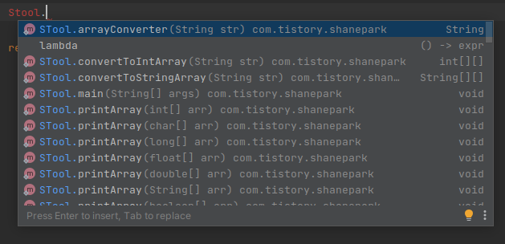

# shaneutils
this repository is for util modules i frequently use

## Intallation

### Gradle
```groovy
allprojects {
  repositories {  
    ...
    maven { url 'https://jitpack.io' }
  }
}
dependencies {
  ...
  implementation 'com.github.Shane-Park:shaneutils:master-SNAPSHOT'
}
```
### Maven
```xml
<repositories>
  <repository>
    <id>jitpack.io</id>
    <url>https://jitpack.io</url>
  </repository>
</repositories>
  
<dependency>
  <groupId>com.github.Shane-Park</groupId>
  <artifactId>shaneutils</artifactId>
  <version>Tag</version>
</dependency>
```

## Preview

